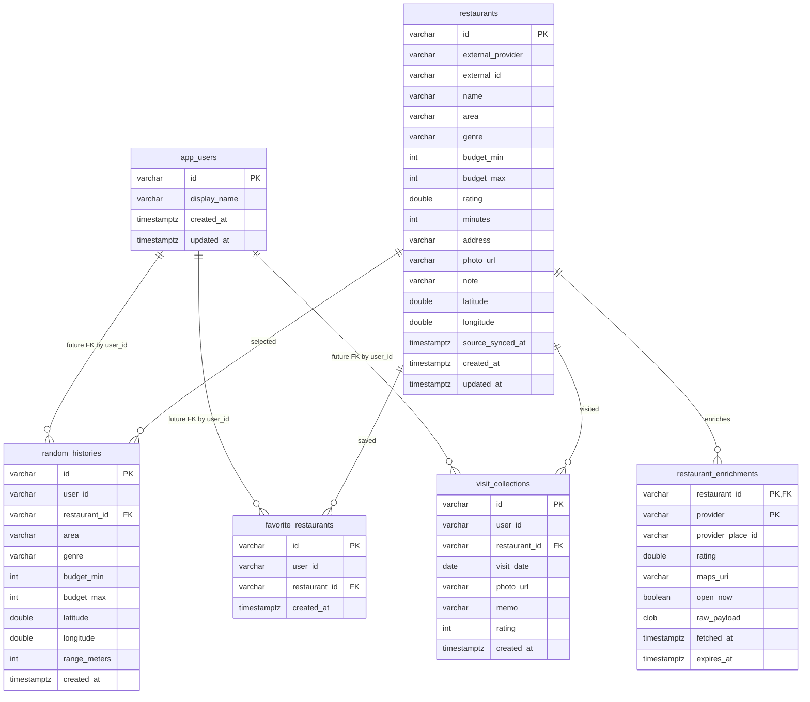

# RANDISH DB Design

## Scope

RANDISH is a restaurant roulette app. The database keeps the canonical restaurant cache and the user's actions around it: draws, favorites, visits, auth/profile data, and Premium billing state.

This design is applied to the current Spring Boot + JDBC + H2 setup in `src/main/resources/schema.sql`, while keeping the shape close to PostgreSQL/Supabase so it can be migrated later.

## Design Principles

- `restaurants` is the app-side cache of external restaurant providers, not a user-owned table.
- User action tables keep `user_id` as a string for the current guest/local user flow. `app_users` exists as the future attachment point for login/auth.
- External data is upserted by stable provider identity: `external_provider + external_id`.
- A draw history stores the selected restaurant and the filter snapshot used at that time.
- Visits are append-only events, so the same user can visit the same restaurant multiple times.
- Favorites are deduplicated by business rules with unique constraints.
- Google/other provider enrichment can be cached separately from the base restaurant row.
- Paid Premium state is normalized across Stripe, App Store, and Google Play in `subscriptions`.
- Admin-granted Premium is kept separate in `premium_grants`.
- Webhook and store notification idempotency is enforced by `payment_events`.

See `premium-billing-design.md` for the App Store / Google Play ready Premium design.

## ER Diagram

## Tables

### `app_users`

Future user/profile table. The current app uses `guest` from the mobile client, so action tables do not yet enforce a user foreign key.

Columns:
- `id`: stable app/auth user id.
- `display_name`: optional display name.
- `created_at`, `updated_at`: audit timestamps.

### `restaurants`

Canonical restaurant cache used by search, random draw, detail, favorites, visits, and statistics.

Important constraints:
- `PRIMARY KEY (id)`
- `UNIQUE (external_provider, external_id)`
- `budget_min >= 0 AND budget_max >= budget_min`
- `rating BETWEEN 0 AND 5`
- `minutes >= 0`

Notes:
- Seed restaurants use `external_provider = RANDISH_SEED`.
- Hot Pepper restaurants use `external_provider = HOTPEPPER`.
- `source_synced_at` is refreshed whenever provider data is upserted.

### `restaurant_enrichments`

Provider-specific cache for data that is useful but not part of the base restaurant model, such as Google Places rating, Maps URI, place id, opening state, and raw payload.

Primary key:
- `(restaurant_id, provider)`

This lets the app cache Google data without overwriting Hot Pepper or seed data.

### `random_histories`

Append-only history of roulette results.

Stores:
- `user_id`
- selected `restaurant_id`
- filter snapshot: area, genre, budget, coordinates, range
- `created_at`

This supports "recently drawn restaurants" avoidance and history screens.

### `favorite_restaurants`

User's saved restaurants.

Important constraints:
- `FOREIGN KEY (restaurant_id) REFERENCES restaurants(id)`
- `UNIQUE (user_id, restaurant_id)`

The unique key keeps the favorite button idempotent at the data level.

### `visit_collections`

Append-only visit records. Multiple rows for the same user and restaurant are allowed because repeat visits should count in statistics.

Important constraints:
- `FOREIGN KEY (restaurant_id) REFERENCES restaurants(id)`
- `rating BETWEEN 0 AND 5`

`existsByUserIdAndRestaurantId` still supports the current "visited?" check.

## Access Patterns And Indexes

The current schema indexes these paths:

- Restaurant filtering: `area`, `genre`, `area + genre + budget_min + budget_max`
- Location-backed search: `latitude + longitude`
- User timelines: `random_histories(user_id, created_at)`, `favorite_restaurants(user_id, created_at)`, `visit_collections(user_id, visit_date)`
- Existence checks: `visit_collections(user_id, restaurant_id)`
- Reverse lookups by restaurant: action tables have `restaurant_id` indexes.
- Enrichment cache expiry: `restaurant_enrichments(provider, expires_at)`

## Migration Path

1. Keep H2 for local development with the current `schema.sql`.
2. Introduce Flyway or Liquibase before production data matters.
3. Move from string-only `user_id` to auth-backed `app_users.id`, then add user foreign keys.
4. For PostgreSQL, convert `raw_payload CLOB` to `jsonb`.
5. For real distance search, use PostGIS `geography(Point, 4326)` or generated location columns instead of plain latitude/longitude indexes.
6. If external provider data grows, split normalized dimensions such as genres, areas, photos, business hours, and provider sync jobs into dedicated tables.

## Open Decisions

- Whether `area` should stay provider-derived text or become a normalized prefecture/city/station model.
- Whether favorites should support folders/tags.
- Whether visit photos should remain URL-only or move to managed object storage metadata.
